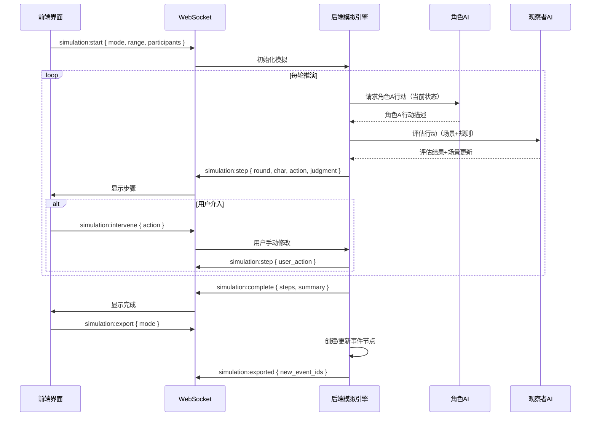

# 叙事沙盘 — 模拟沙盘设计

**版本**：v2.0.0  
**状态**：概念设计  
**更新日期**：2026-06-06

> 核心思想：在选定的事件节点内，让角色基于设定自主行动，
> 第三方观察者实时评估合理性，用户最终审查确认。

---

## 目录

1. [设计总览](#一设计总览)
2. [两种推演场景](#二两种推演场景)
3. [推演流程图](#三推演流程图)
4. [推演引擎](#四推演引擎)
5. [第三方观察者](#五第三方观察者)
6. [回退策略](#六回退策略)
7. [与事件模型的交互](#七与事件模型的交互)
8. [WebSocket 实时交互](#八websocket-实时交互)
9. [成本控制](#九成本控制)

---

## 一、设计总览

模拟沙盘是叙事沙盘的核心交互模块。它的作用不是"写"，而是**"演"**——把角色放进一个事件场景中，看他们会怎么行动，再决定是否采纳这个推演结果。

```
用户选择事件范围
    ↓
系统初始化场景 + 角色状态
    ↓
┌─────────────────────────────────────┐
│         推演循环                      │
│                                      │
│  角色A 输出行动 ←── 第三方观察者评估  │
│  角色B 输出行动 ←── 第三方观察者评估  │
│  角色C 输出行动 ←── 第三方观察者评估  │
│          ↓                           │
│  更新场景状态                         │
│  检查终止条件                         │
└─────────────────────────────────────┘
    ↓
输出推演步骤 → 用户审查 → 导出（覆盖/子事件/新事件）
```

### 1.1 核心原则

- **沙盘不维护完整的世界状态**，只维护**推演范围内**的状态
- 所有角色行动基于用户预设的初始条件，不在推演范围外编造
- 推演结果需经用户审查确认才能进入数据模型

---

## 二、两种推演场景

模拟沙盘有两种使用场景：

### 2.1 方式A：填补空白

在两个已有事件节点之间推演，生成中间事件。

| 项目 | 说明 |
|------|------|
| **范围** | 两个已有事件节点之间 |
| **输入** | 前一个事件的 `outcome` + 后一个事件的 `in_edges` |
| **输出** | 中间发生的一个或多个新事件节点 |
| **适用** | 因果链中的"空白"需要填充 |

```
推演前：
ev_before（前因事件）──？──→ ev_after（后果事件）

推演后：
ev_before（前因事件）──→ ev_new_1 ──→ ev_new_2 ──→ ev_after（后果事件）
```

### 2.2 方式B：延伸剧情

对某个父事件内部进行细化推演，将其概括性的 `process` 拆解为多个具体的子事件。

| 项目 | 说明 |
|------|------|
| **范围** | 某个父事件内部 |
| **输入** | 父事件的 `process`（概括描述）+ `participants` |
| **输出** | 拆解为 `sub_events` 列表 |
| **适用** | "酒馆冲突"这样需要细化的关键场景 |

```
推演前：
事件 ev_tavern（酒馆冲突）
├── type: event
├── process: "主角走进酒馆，反派挑衅，酒保介入…"  ← 概括描述
├── sub_events: []
└── participants: [主角, 反派, 酒保]

推演后：
事件 ev_tavern（酒馆冲突）
├── type: mixed
├── process: "酒馆冲突概述…"
├── sub_events: [ev_enter, ev_provoke, ev_confront, ev_fight, ev_end]
└── participants: [主角, 反派, 酒保]
```

---

## 三、推演流程图

```mermaid
flowchart TD
    START([用户选择事件范围]) --> INIT[初始化模拟]

    INIT --> INIT_SCENE[加载事件场景描述<br/>从 event.process / event.introduction]
    INIT --> INIT_CHARS[加载参与者<br/>从 event.participants + 实体完整设定]
    INIT --> INIT_RULES[加载约束规则<br/>硬约束 / 软约束 / 世界观规则]
    INIT --> INIT_STATE[生成初始状态描述<br/>推送给所有角色 AI]

    INIT_STATE --> LOOP{推演循环}

    LOOP --> TURN[轮到下一个角色行动]

    TURN --> CALL_AI[调用角色 AI<br/>输入：当前状态 + 角色设定]
    CALL_AI --> ACTION[角色输出行动描述]

    ACTION --> OBSERVER[第三方观察者评估]

    OBSERVER --> APPROVED{评估结果}

    APPROVED -->|合理| UPDATE_STATE[更新场景状态<br/>记录本轮行动]
    APPROVED -->|部分合理| FLAG[标记问题提醒<br/>继续执行]
    APPROVED -->|严重不合理| ROLLBACK{尝试回退}

    FLAG --> UPDATE_STATE
    UPDATE_STATE --> CHECK_END{终止条件}

    ROLLBACK --> RETRY_COUNT{回退次数<br/><=3次?}
    RETRY_COUNT -->|是| ROLLBACK_ACTION[回退到上一状态<br/>要求角色输出替代行动]
    RETRY_COUNT -->|否| REQUEST_USER[请求用户手动介入]

    ROLLBACK_ACTION --> TURN
    REQUEST_USER --> MANUAL_INPUT[用户手动输入行动或打断]
    MANUAL_INPUT --> UPDATE_STATE

    CHECK_END -->|还有角色待行动| LOOP
    CHECK_END -->|本轮完成| ROUND_CHECK{是否有明显进展?}

    ROUND_CHECK -->|有| NEXT_ROUND[开始下一轮]
    ROUND_CHECK -->|连续3轮无进展| ROLLBACK

    NEXT_ROUND --> LOOP

    CHECK_END -->|达成目标/超出轮次上限| DONE[推演完成]
    DONE --> REVIEW[用户审查推演步骤]

    REVIEW --> ACCEPT{用户决定}

    ACCEPT -->|接受| EXPORT[导出结果]
    ACCEPT -->|部分接受| EDIT[用户编辑修改步骤]
    ACCEPT -->|不接受| DISCARD[丢弃，重新设定初始条件]

    EDIT --> EXPORT
    DISCARD --> START

    EXPORT --> EXPORT_OPTIONS{导出方式}

    EXPORT_OPTIONS -->|覆盖原事件| OVERWRITE[用推演结果替换<br/>原 event.process]
    EXPORT_OPTIONS -->|作为子事件| SUB_EVENTS[将推演步骤创建为<br/>原事件的 sub_events[]<br/>原事件 type→mixed]
    EXPORT_OPTIONS -->|作为新事件| NEW_EVENT[创建为独立事件节点<br/>插入 spine 中]

    OVERWRITE --> FIN([完成])
    SUB_EVENTS --> FIN
    NEW_EVENT --> FIN
```

---

## 四、推演引擎

### 4.1 核心循环

```
1. 用户选择要推演的事件范围（方式A：两事件之间 / 方式B：父事件内部）
2. 系统初始化：
   a. 加载事件场景（event.process + event.introduction）
   b. 加载参与者列表（event.participants → 关联的实体完整设定）
   c. 加载约束规则（world_rules + 硬约束/软约束）
   d. 生成当前状态描述，推送给所有角色 AI
3. 推演循环（直到达到终止条件）：
   a. 依次让每个角色输出行动（调用小模型角色扮演）
      - 输入：当前场景状态 + 角色设定（性格/目标/当前状态）
      - 输出：角色的行动描述（说话内容 + 行为意图 + 情感表达）
   b. 第三方观察者评估合理性
   c. 更新场景状态
   d. 检查终止条件
4. 输出完整的事件链供用户审查
```

### 4.2 角色 AI 接口

```
输入:
  - 当前场景状态描述（文本）
  - 角色完整设定（性格/目标/当前心理状态/身体状况）
  - 角色对当前环境的感知
  - 其他角色最近的行动摘要

输出:
  - 说话内容（对话/独白）
  - 行为意图（动作描述）
  - 情感表达（表情/语气）
```

### 4.3 终止条件

```
推演终止条件:
  - 达到预设轮次上限 → 结束
  - 达成推演目标 → 结束
    - 方式A：成功连接到后果事件
    - 方式B：父事件的 process 被充分展开
  - 连续 3 轮无明显进展 → 回退或请求用户介入
  - 超过回退次数 → 请求用户手动介入
  - 用户主动终止 → 结束
```

---

## 五、第三方观察者

第三方观察者是模拟沙盘中的"理性裁判"，实时评估每一步角色行动的合理性。

### 5.1 判断规则

```yaml
硬约束（不可违反）:
  - 主角不能死于非主线冲突（用户可预设）
  - 角色 A 和 角色 B 不能提前相遇（用户可预设）
  - 时间不能倒流（除非世界观设定允许）
  - 角色不能做出与自身核心目标完全相反的行为

软约束（可违反但需标记）:
  - 角色行为是否符合性格设定
  - 因果链是否成立
  - 情感转变是否有铺垫
  - 对话风格是否符合角色身份

自动回退触发条件:
  - 违反硬约束 → 立即回退
  - 连续 3 轮无明显进展 → 回退
  - 角色输出与自身设定目标矛盾 → 回退
  - 角色之间的行动逻辑冲突 → 回退
```

### 5.2 评估输出

```json
{
  "round": 3,
  "char_id": "ch_fanpai",
  "action": "陈豹拍桌站起，大喊\"林深！你跑不掉了！\"",
  "assessment": "approved",
  "comment": "符合角色性格：暴躁易怒"
}
```

| 评估结果 | 含义 | 后续操作 |
|---------|------|---------|
| **approved** | 合理，通过 | 更新状态，继续下一轮 |
| **flagged** | 部分不合理，有疑问 | 继续执行但标记问题给用户看 |
| **rejected** | 严重不合理 | 自动回退，要求替代行动 |

### 5.3 评估流程

```
角色输出行动描述
    ↓
观察者检查硬约束：
  ├─ 是否违反任何硬约束？
  │   ├─ 是 → 立即 rejected，触发回退
  │   └─ 否 → 继续
  │
  ├─ 检查角色行为与设定的匹配度
  │
  ├─ 检查情感转变是否有铺垫
  │
  └─ 检查行动逻辑是否与场景状态一致
      ↓
综合评分 → approved / flagged / rejected
```

---

## 六、回退策略

### 6.1 死循环黑名单

```go
type DeadlockBlacklist struct {
    EventID     string
    Round       int
    FailedPaths []string  // 记录失败的行动组合/模式
}

// 下次回退时，检查黑名单，避免重复
func (e *SimulationEngine) GetAlternativeAction(blacklisted ...string) string {
    // 请求AI时，在prompt中明确："不要尝试以下行动：xxx"
}
```

### 6.2 回退流程

```
违反硬约束 / 连续3轮无进展 / 角色目标矛盾 / 行动逻辑冲突
    ↓
┌─────────────────────────────────────┐
│ 回退次数 <= 3 次？                    │
├─────────────────────────────────────┤
│ 是 → 回退到上一状态                   │
│      检查死循环黑名单                  │
│      要求角色输出替代行动              │
│      记录失败模式到黑名单              │
│                                      │
│ 否 → 请求用户手动介入                  │
│      用户可：                         │
│      - 手动输入角色行动                │
│      - 调整初始条件                   │
│      - 终止推演                       │
└─────────────────────────────────────┘
```

### 6.3 回退策略说明

- **轮次级回退**：回退到上一轮的状态，不是回到初始状态
- **黑名单机制**：记录已经尝试过但失败的行动模式，避免重复踩坑
- **用户兜底**：超过 3 次回退后不再自动尝试，请求用户手动介入
- **状态快照**：每轮结束后保存状态快照，回退时直接加载

---

## 七、与事件模型的交互

### 7.1 推演前（方式B：父事件内部填充）

```
事件 ev_tavern（酒馆冲突）
├── type: event                      ← 目前是普通事件
├── process: "主角走进酒馆，反派挑衅，酒保介入…"  ← 推演前只有概括描述
├── sub_events: []                   ← 还没有子事件
└── participants: [主角, 反派, 酒保]
```

### 7.2 推演后（作为子事件导出）

```
事件 ev_tavern（酒馆冲突）
├── type: mixed                      ← 从 event 变为 mixed
├── process: "酒馆冲突概述…"         ← 保留概括内容
├── sub_events: [                    ← 推演产生的子事件
│   ev_enter（进门）
│   ev_provoke（挑衅）
│   ev_confront（对峙）
│   ev_fight（动手）
│   ev_end（收尾）
│ ]
└── participants: [主角, 反派, 酒保]
```

### 7.3 推演后（作为新事件插入方式A）

```
推演前：
ev_before（前因事件）──？──→ ev_after（后果事件）

推演后：
ev_before（前因事件）──→ ev_new_1（新事件）──→ ev_new_2（新事件）──→ ev_after（后果事件）

新事件自动插入：
- ev_before.out_edges 更新，包含 ev_new_1
- ev_new_2.out_edges 更新，包含 ev_after
- spine：在 ev_before 和 ev_after 之间插入新事件 ID
```

### 7.4 三种导出方式对比

| 导出方式 | 适用场景 | 模型变化 |
|---------|---------|---------|
| **覆盖原事件** | 推演结果就是该事件的最终内容 | 更新 `event.process` |
| **作为子事件** | 推演产生了多个明确的步骤，适合拆开 | 原事件新增 `sub_events[]`，`type → mixed` |
| **作为新事件** | 方式A：填补两个事件之间的空白 | 创建新的事件节点，插入因果链和 spine |

### 7.5 与旧模型的区别

| 项目 | 旧模型 | 新模型 |
|------|--------|--------|
| 导出为子事件 | 需要手动创建 StorySegment + 添加事件关联 | 直接在父事件的 `sub_events[]` 中添加 ID |
| 导出为覆盖 | 更新 `event.desc` | 更新 `event.process` |
| 容器推演 | 涉及 StorySegment 和独立的事件列表 | `type=container/mixed` 的事件，推演其 sub_events |
| 推演的粒度控制 | 段级或事件级，需要切换上下文 | 统一在事件级，通过 type 判断是否展开 |

---

## 八、WebSocket 实时交互

### 8.1 事件流



### 8.2 WebSocket 事件列表

| 事件 | 方向 | 说明 |
|------|------|------|
| `simulation:start` | client → server | 开始模拟，传入 mode（填补空白/延伸剧情）、范围、参与者列表 |
| `simulation:step` | server → client | 推送每一步结果（角色行动 + 观察者判定） |
| `simulation:intervene` | client → server | 用户手动介入，修改角色行动或场景 |
| `simulation:pause` | client → server | 暂停推演 |
| `simulation:resume` | client → server | 恢复推演 |
| `simulation:complete` | server → client | 推演完成，返回完整步骤记录 |
| `simulation:export` | client → server | 导出推演结果，指定导出模式（覆盖/子事件/新事件） |
| `simulation:exported` | server → client | 导出完成，返回新事件 ID |

### 8.3 前端界面布局

```
┌─────────────────────────────────────────────────────────────┐
│  模拟推演 - 酒馆冲突                           [重新模拟][接受]│
├─────────────────────────────────────────────────────────────┤
│  初始场景：酒馆，主角被认出                                   │
│  参与角色：主角(林深)、反派(陈豹)、酒保(王伯)                  │
├─────────────────────────────────────────────────────────────┤
│  步骤记录：                                                  │
│                                                             │
│  [1] 陈豹拍桌站起，大喊"林深！你跑不掉了！"                   │
│      👤 观察者：符合角色 ✓                                   │
│                                                             │
│  [2] 林深低头喝酒，手摸向匕首                                 │
│      👤 观察者：符合角色 ✓                                   │
│                                                             │
│  [3] 酒保上前询问："客官，需要帮忙吗？"                       │
│      👤 观察者：意外事件，合理 ✓                              │
│                                                             │
│  [4] 陈豹推开酒保，拔刀向主角走来                             │
│      👤 观察者：符合角色 ✓                                   │
│                                                             │
│  [5] 等待角色行动... (模拟中)                                │
│                                                             │
├─────────────────────────────────────────────────────────────┤
│  [手动介入]  [暂停]  [快进]                                   │
└─────────────────────────────────────────────────────────────┘
```

---

## 九、成本控制

### 9.1 模型分层

| 阶段 | 模型 | 说明 |
|------|------|------|
| 角色扮演 | 小模型（7B） | 每轮每个角色，任务简单（角色对话/行动） |
| 观察者评估 | 小模型（7B） | 每轮，任务简单（合理性判断） |
| 状态更新 | 规则引擎 | 无需模型，本地更新 |

> 模拟沙盘全程使用小模型，仅在用户最终确认生成正文时才调用 DeepSeek 大模型。

### 9.2 缓存优化

- **角色设定缓存**：每个角色的完整设定在初始化时加载，推演过程中不重复请求
- **场景状态增量更新**：只传递本轮变化的增量状态，而非完整场景描述
- **观察者规则缓存**：硬约束/软约束规则列表只加载一次

---

> **文档结束**
