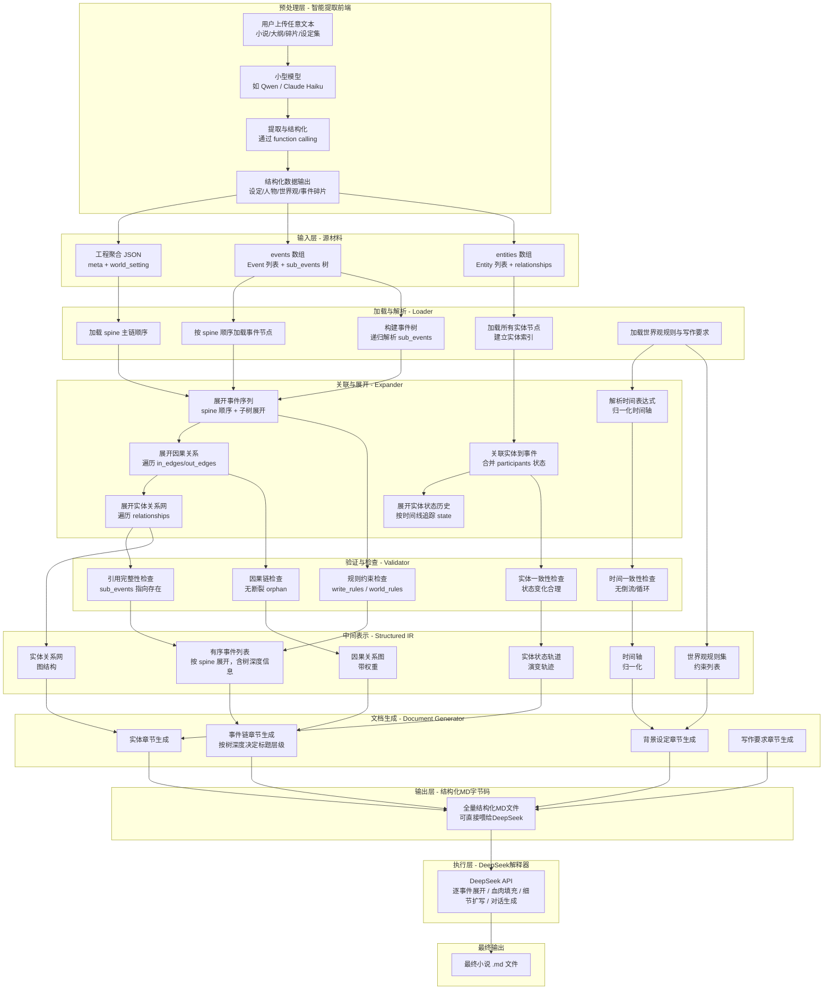
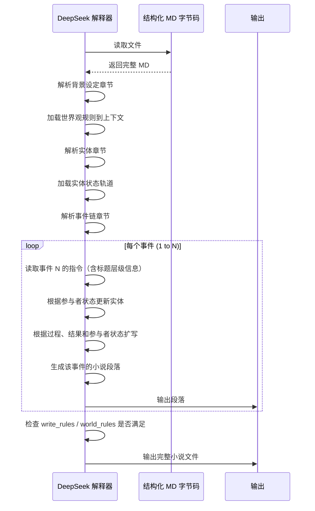

# 叙事沙盘 — 编译管线设计

**版本**：v2.0.1  
**状态**：概念设计  
**更新日期**：2026-06-10

> 核心思想：JSON 事件文件是"源代码"，结构化 MD 文件是"字节码"，
> DeepSeek 是"解释器"——逐事件读取字节码，展开成小说正文。

---

## 目录

1. [设计总览](#一设计总览)
2. [编译流程图](#二编译流程图)
3. [各阶段说明](#三各阶段说明)
4. [加载与解析（Loader）](#四加载与解析loader)
5. [关联与展开（Expander）](#五关联与展开expander)
6. [验证与检查（Validator）](#六验证与检查validator)
7. [中间表示（IR）](#七中间表示ir)
8. [文档生成（Document Generator）](#八文档生成document-generator)
9. [从事件树到线性 MD](#九从事件树到线性-md)
10. [结构化 MD 字节码结构](#十结构化-md-字节码结构)
11. [DeepSeek 解释器执行流程](#十一deepseek-解释器执行流程)
12. [编译错误与警告](#十二编译错误与警告)

---

## 一、设计总览

### 1.1 管线全貌

```
事件JSON（源代码） → 加载/解析 → 关联/展开 → 验证/检查
  → 中间表示（IR） → 文档生成 → 结构化MD（字节码）
  → DeepSeek（解释器） → 最终小说
```

### 1.2 为什么叫"编译管线"

| 概念 | 类比解释 | 在本系统中 |
|------|----------|-----------|
| **源代码** | 人类编写的程序代码 | 当前实现以聚合工程 JSON 为主，逻辑上可拆分为 `meta/world_setting/events/entities` 四部分 |
| **编译器** | 将源代码转换为可执行格式 | 编译管线 |
| **字节码** | 中间可执行格式 | 结构化 Markdown 文件 |
| **解释器** | 逐行读取字节码并执行 | DeepSeek API（读取 MD，逐事件展开） |

### 1.3 核心优势

- **零成本迭代**：大纲生成（编译管线）不需要大模型，用户可以无限次调整
- **可验证**：编译管线包含静态检查阶段，自动发现问题
- **确定性输出**：给定相同的 JSON 节点，编译管线总是输出相同的 MD 大纲
- **严格对齐**：DeepSeek 逐事件展开，不添加大纲中没有的内容

---

## 二、编译流程图



---

## 三、各阶段说明

| 阶段 | 名称 | 功能 | 类比 |
|------|------|------|------|
| **输入层** | 源材料 | 当前实现中的聚合工程 JSON，包含 `meta / world_setting / events / entities` | 源代码文件 |
| **加载与解析** | Loader | 读取并解析 JSON，加载 spine 顺序，构建事件树（sub_events） | 读取源文件 + 解析 AST |
| **关联与展开** | Expander | 展开关系、合并状态、计算时间轴、确定树深度 | 链接/符号解析 |
| **验证与检查** | Validator | 检查约束、一致性、完整性 | 静态检查 |
| **中间表示** | Structured IR | 统一的结构化数据，含树深度信息和警告 | AST + 符号表 |
| **文档生成** | Document Generator | 生成结构化 MD 文档（根据树深度决定标题层级） | 字节码生成 |
| **输出层** | 结构化 MD 字节码 | 一份完整的 MD 文件，可直接喂给 DeepSeek | 字节码 |
| **执行层** | DeepSeek 解释器 | 读取 MD 文件，逐事件展开执行 | 虚拟机 |

---

## 四、加载与解析（Loader）

### 4.1 职责

将磁盘上的工程 JSON 加载到内存中，并整理成便于编译阶段使用的索引结构。

### 4.2 处理流程

| 步骤 | 操作 | 产出 |
|------|------|------|
| 1 | 读取工程聚合 JSON | `Project` 或 `ProjectObj` 的序列化内容 |
| 2 | 解析 `ProjectMeta` 与 `WorldSetting` | 工程标题、保存路径、`spine/time_system/write_rules/world_rules` |
| 3 | 加载事件集合 | `[]Event` 或 `map[string]Event` 形式的事件索引 |
| 4 | 递归解析每个事件的 `sub_events[]` | 事件树结构（父 → 子） |
| 5 | 加载实体集合 | `[]Entity` 或 `map[string]Entity` 形式的实体索引 |
| 6 | 构建辅助索引 | 参与者、实体关系、校验所需的引用表 |

### 4.3 数据结构

```go
type Project struct {
    Meta         ProjectMeta
    WorldSetting WorldSetting
    Events       []Event
    Entities     []Entity
}

type ProjectMeta struct {
    RootDir     string
    Title       string
    Author      string
    Settings    map[string]string
    CreatedAt   string
    UpdatedAt   string
    EventCount  int
    EntityCount int
}

type WorldSetting struct {
    TimeSystem []string
    TimeLabels map[string]string
    Spine      []string
    WriteRules []string
    WorldRules []string
}

type ProjectObj struct {
    ProjectMeta        ProjectMeta
    WorldSetting       WorldSetting
    Events             map[string]Event
    Entities           map[string]Entity
    Participant        map[string]Participant
    EntityRelationship map[string]EntityRelationship
    Entity             map[string]Entity
}

type EventType string

const (
    EventTypeEvent     EventType = "event"
    EventTypeContainer EventType = "container"
    EventTypeMixed     EventType = "mixed"
)

type EdgeType string

const (
    EdgeTypeCause  EdgeType = "cause"
    EdgeTypeResult EdgeType = "result"
)

type EventEdge struct {
    Target   string
    Type     EdgeType
    Discribe map[string]string
}

type Participant struct {
    EntityID string
    State    map[string]string
}

type Event struct {
    ID           string
    Name         string
    Introduction string
    Type         EventType
    Time         map[string]string
    SettingRef   string
    InEdges      []EventEdge
    OutEdges     []EventEdge
    SubEvents    []string
    Participants []Participant
    Process      string
    Outcome      map[string]string
    Locked       bool
}

type EntityRelationship struct {
    TargetID     string
    RelationType string
    Description  map[string]string
}

type Entity struct {
    ID            string
    Name          string
    Type          string
    Introduction  []string
    Relationships []EntityRelationship
    RuleRefs      []string
    Events        []string
}
```

> 当前实现同时存在 `Project`（偏序列化/交换格式）和 `ProjectObj`（偏运行态索引结构）。
> 其中 `ProjectMeta.RootDir` 在 `obj.go` 中被直接用作保存文件路径，而不只是逻辑上的工程根目录。

---

## 五、关联与展开（Expander）

### 5.1 职责

将加载后的原始数据展开为完整的关系网络，为后续的验证和文档生成做准备。

### 5.2 处理流程

| 步骤 | 操作 | 产出 |
|------|------|------|
| **E1** | 展开事件序列 | 按 spine 顺序遍历，遇到 sub_events 递归展开，记录每个事件的树深度 |
| **E2** | 关联实体到事件 | 根据 `Participant.EntityID` 关联实体，并保留 `state` 快照 |
| **E3** | 展开实体状态历史 | 按时间线（spine 顺序）追踪每个实体在各事件中的 `state` 变化 |
| **E4** | 展开因果关系 | 遍历 `in_edges/out_edges`，解析 `EventEdge.Target/Type/Discribe` |
| **E5** | 展开实体关系网 | 遍历 `Entity.Relationships`，构建实体关系图 |
| **E6** | 解析时间表达式 | 根据 time_system 定义，将 time 字段展开为可读字符串 |

### 5.3 树深度计算

```
展开后的事件列表包含以下信息：
{
  "event": Event,
  "depth": 0,           // 树深度（从0开始）
  "parent_id": null,    // 父事件 ID（根事件为 null）
  "children": [...]     // 子事件列表
}
```

---

## 六、验证与检查（Validator）

### 6.1 职责

在生成 MD 之前检查数据的一致性和完整性，避免将错误传递给 DeepSeek。

### 6.2 检查项

| 编号 | 检查项 | 阻断 | 触发条件 |
|------|--------|------|----------|
| **V1** | 规则约束检查 | ✅ | 检查 `world_rules`、`write_rules` 与工程设置是否被违反 |
| **V2** | 实体一致性 | ✅ | 实体状态变化是否合理 |
| **V3** | 时间一致性 | ✅ | 因果链上的时间顺序是否矛盾 |
| **V4** | 因果链检查 | ⚠️ | 事件链中是否存在断开的因果引用（orphan） |
| **V5** | 引用完整性 | ✅ | sub_events 指向的事件是否存在，out_edges 指向是否存在 |

## 七、中间表示（IR）

中间表示是编译管线的枢纽，承载展开后的完整数据供文档生成器使用。

### 7.1 IR 结构

```go
type IntermediateRepresentation struct {
    Meta         ProjectMeta
    WorldSetting WorldSetting

    // 运行态索引的稳定拷贝
    EventIndex  map[string]Event
    EntityIndex map[string]Entity

    // 按 spine 展开的事件序列
    EventList []OrderedEvent

    // 实体状态轨道
    EntityTracks map[string][]EntityStateTrack

    // 验证结果
    Validation ValidationResult
}

type OrderedEvent struct {
    Event      Event
    Depth      int
    SpineIndex int
    ParentID   string
    Children   []string
}

type EntityStateTrack struct {
    EventID string
    Time    map[string]string
    State   map[string]string
}
```

### 7.2 IR 生成时机

IR 是**瞬时数据**，每次编译时重新生成，不持久化。但如果需要缓存，可以缓存到 Redis：

```
sandbox:{project_id}:ir  →  IR 的 JSON 序列化
```

缓存失效条件：项目中的任何节点被修改。

---

## 八、文档生成（Document Generator）

### 8.1 职责

将 IR 中的结构化数据渲染为一份人类可读的 Markdown 文件。

### 8.2 生成的四个章节

```
┌────────────────────────────────────────────┐
│  第一章节：背景设定                          │
│  ├─ 世界观规则（列表）                       │
│  └─ 时间系统说明                             │
├────────────────────────────────────────────┤
│  第二章节：实体与关系                        │
│  ├─ 实体列表（表格）                         │
│  ├─ 实体关系网（Mermaid 图）                  │
│  └─ 实体状态演变轨道（表格/列表）              │
├────────────────────────────────────────────┤
│  第三章节：事件链（核心字节码）               │
│  ├─ 主链顺序（spine 数组）                   │
│  └─ 按树层级的每个事件展开指令：              │
│      ├─ 标题层级：根据容器深度决定            │
│      ├─ 名称/描述/时间                       │
│      ├─ 参与者状态变化表                     │
│      ├─ 环境/感官/心理细节                   │
│      ├─ 出边关系                             │
│      └─ 执行指令（字数、扩写方向）            │
├────────────────────────────────────────────┤
│  第四章节：写作要求与约束                     │
│  ├─ write_rules（写作要求）                  │
│  ├─ world_rules（世界规则）                  │
│  └─ settings（工程级补充设置）               │
└────────────────────────────────────────────┘
```


---

## 九、从事件树到线性 MD

这是编译管线的核心转换：**树结构在数据层存在，输出层压平成线性文档**。

### 9.1 转换规则

```
规则：
  type=container  → 渲染为标题（#），递归处理 sub_events
  type=mixed      → 渲染为标题（#）+ 自身内容，递归处理 sub_events
  type=event      → 渲染为内容块（###），不递归
```

### 9.2 示例

```
事件树：
ev_vol_1（第一卷·风起，type=container，depth=0）
├── ev_ch_1（第一章·入京，type=container，depth=1）
│   ├── ev_001（出发，type=event，depth=2）
│   └── ev_002（遇刺，type=event，depth=2）
└── ev_ch_2（第二章·立威，type=container，depth=1）
    └── ev_003（朝堂对峙，type=event，depth=2）
ev_004（后续事件，type=event，depth=0）
```

深度优先遍历后：

```markdown
# 第一卷：风起                 ← container，depth=0 → `#`

## 第一章：入京                 ← container，depth=1 → `##`

### 出发                       ← event，depth=2 → `###`
李葬收拾行囊…

### 遇刺
路上遭遇伏击…

## 第二章：立威

### 朝堂对峙
满朝文武…

### 后续事件                   ← event，depth=0 → `###`
接下来发生的事…
```

### 9.3 实现逻辑

---

## 十、结构化 MD 字节码结构

### 10.1 输出示例（白华录大纲节选）

```markdown
# 《白华录》叙事大纲（第一阶段：岑州十载）

> 时间系统：李葬年龄 / 年号（白华纪年）/ 季节
> 主叙事链：ev_001 → ev_002 → ... → ev_010

---

## 21岁 · 白华元年 · 春

### 受封岑州

白华授地，非因器重，实为避祸。朝廷忌惮陈龄门徒，欲使李葬远离中枢。

李葬携师门残卷三册、亲随十七人赴任。岑州地瘠民杂，五族混居
（福瑞、云奇、树妖、人族、折木）。无兵无粮，唯有一纸诏书。

- **参与者**：李葬（主角，初到岑州，雄心谨慎）
- **影响**：从中枢边缘人被推向现实治理

---

## 22岁 · 白华二年 · 夏

### 施政遇阻

欲行均田，召豪绅议事。豪绅笑曰："君自南来，不知此土之性。
田非官授，乃先祖所争。"

强推三日，乡吏阳奉阴违，田籍混乱不可考。百姓观望，无人响应。
李葬始知：令不出府门，空有仁心，不如无心。

- **参与者**：李葬（受挫，反思）
- **影响**：认识到地方势力的顽固
```

### 10.2 字节码的特性

1. **完整自包含**：一份 MD 包含所有必要信息，无需外部引用
2. **层级清晰**：标题层级直接对应事件树的包含关系
3. **可人工审阅**：MD 格式对人类友好的同时，对 AI 也足够结构化
4. **可版本控制**：MD 文件是纯文本，可纳入 Git 管理

---

## 十一、DeepSeek 解释器执行流程

### 11.1 执行过程



### 11.2 Prompt 模板

```markdown
你是一个小说作家。请严格按照以下大纲进行创作。

世界设定：{世界设定}

## 大纲（不可偏离）
{导出的大纲内容(经过格式化,符合MD语法,形成完整叙事链和事件因果等全部内容)}

## 写作要求
- 严格按照上述事件顺序展开
- 不要添加大纲中没有的事件
- 不要改变事件的因果顺序
- 可以在事件框架内添加合理的细节、对话、环境描写
- 文风要求：{用户预设风格}

请输出该事件节点对应的小说内容。
```

---

## 十二、编译错误与警告

### 12.1 编译错误（阻断编译）

| 编号 | 错误名 | 检测到 | 建议 |
|------|--------|--------|------|
| **E001** | 引用完整性错误 | sub_events / out_edges 指向不存在的节点 | 检查 ID 或删除引用 |
| **E002** | 时间一致性错误 | 因果链上的时间顺序矛盾 | 调整 time 字段或交换 spine 顺序 |
| **E003** | 循环引用错误 | sub_events 形成循环（A→B→A） | 检查 sub_events 定义 |

### 12.2 编译警告（不阻断编译）

| 编号 | 警告名 | 检测到 | 建议 |
|------|--------|--------|------|
| **W001** | 实体状态缺失 | 实体参与了事件但没有定义 state | 在 participants 中补充 state 字段 |
| **W002** | 因果链薄弱 | 事件间没有直接出边，仅通过 spine 顺序关联 | 如果存在因果关系，在 out_edges 中添加引用 |
| **W003** | 空容器警告 | type=container 但 sub_events 为空 | 添加子事件，或将 type 改为 event |

### 12.3 错误报告示例

```markdown
## 编译错误 - 项目: 向日葵地 (proj_001)
时间: 2026-06-06T14:30:00Z

### 错误 (阻断编译)
1. [E001] 引用完整性错误
   - 节点 ev_015 的 out_edges 引用了不存在的节点 ev_999
   - 建议: 检查 out_edges 或删除该引用

2. [E002] 时间一致性错误
   - ev_003 的时间在 ev_005 之后，但因果链显示 ev_003 在 ev_005 之前
   - 建议: 调整 time 字段或交换 spine 顺序

3. [E003] sub_events 循环引用
   - ev_010 的 sub_events 包含 ev_020，ev_020 的 sub_events 又包含 ev_010
   - 建议: 检查 sub_events 定义，不能形成循环

### 警告 (不阻断)
1. [W001] 实体状态缺失
   - 实体 ch_unknown 在 ev_012 中参与但没有定义 state
   - 建议: 在 participants 中补充 state 字段

2. [W002] 因果链薄弱
   - ev_007 → ev_008 的因果关系强度较弱（无直接出边，仅通过 spine 顺序关联）
   - 建议: 如果存在因果关系，在 out_edges 中添加引用

3. [W003] container 事件没有子事件
   - ev_vol_1 的 type=container 但 sub_events 为空
   - 建议: 添加子事件，或将 type 改为 event
```

---

> **文档结束**
